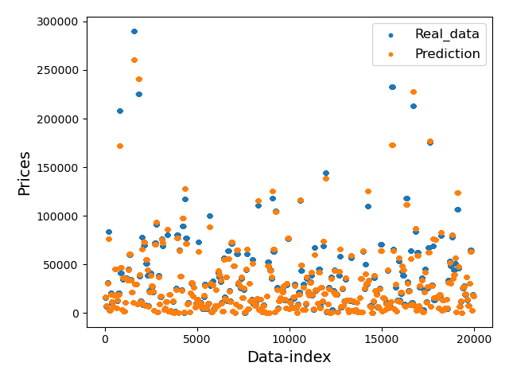
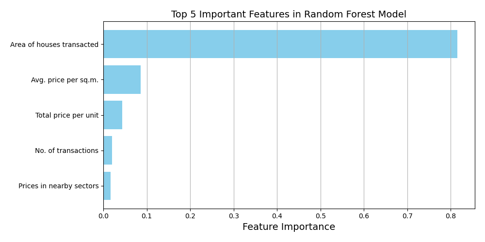
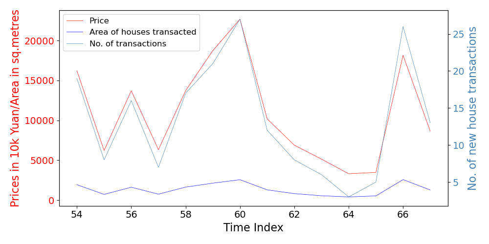

# 🏙️ China Real Estate Demand Prediction

## 📘 Overview
This project was developed as part of **China's first real-estate demand prediction challenge**, which aims to forecast housing demand and guide **real-world investment decisions**.  
The challenge invites the data science community to build predictive models capable of estimating **monthly residential sales** for new housing projects across China — a task that’s crucial for investors, developers, and policymakers in one of the world’s most dynamic property markets.

---

## 🎯 Project Objective
The main goal is to **develop machine learning models** that can accurately predict monthly real estate demand based on:
- Historical transaction data  
- Market and economic indicators  
- Other real estate attributes (e.g., location, type, launch month, etc.)

The output of the models is a numerical prediction representing the **prices new house transactions** for each housing project.

---

## 🧠 Methodology

### 1. **Data Preparation & Feature Engineering**
- Performed data cleaning and preprocessing to handle missing or inconsistent entries.  
- Created new features derived from existing attributes to capture temporal and spatial trends.  
- Normalized numerical variables and encoded categorical features.  

### 2. **Model Development**
Two different approaches were implemented to explore model performance:

#### **a. Random Forest Regressor**
- A tree-based ensemble model designed to capture **non-linear relationships** and **feature interactions**.
- Tuned hyperparameters such as the number of trees, depth, and minimum samples per split.
- Provided strong baseline performance with good interpretability.

#### **b. Neural Network (Perceptron)**
- Implemented a **feed-forward multilayer perceptron (MLP)** for deeper learning of complex patterns.
- Used dense layers with ReLU activation and dropout for regularization.
- Optimized using stochastic gradient descent and mean squared error loss.

### 3. **Model Evaluation**
- The models were evaluated on the **test dataset** using metrics such as:
  - **Mean Absolute Error (MAE)**
  - **Root Mean Squared Error (RMSE)**
  - **R² score**
- Comparative performance analysis was carried out between Random Forest and Neural Network models.

---

## 📊 Results

Below is a sample plot comparing the **real data** and the **model predictions**:

- **Blue points:** Real observed housing demand  
- **Orange points:** Model-predicted demand  

The distribution shows that while most predictions align well with the lower and mid-range demand, there is still some underestimation in extreme high-price regions which is a common challenge in real estate forecasting due to data imbalance.

 
Here is a plot comparing the **feature importance** of **top 5 features**:

The bar plot shows that the area of houses being transacted and the number of transactions are determining factors for the price of real estate.

 
This plot compares the trend of **real estate prices** and the features **area of houses** and **number of transactions** with time in a particular sector:

- **Red line:** Real estate prices (target)
- **Blue line:** Area of houses transacted  
- **Cyan line:** No. of transactions 

There is a clear correlation between the real estate prices and the features in time for a particular sector.

---

## 🧩 Files Included

| File | Description |
|------|--------------|
| `feature_eng_fit_RandomForest.ipynb` | Notebook implementing feature engineering and Random Forest model training. |
| `feature_eng_fit_NN_Perceptron.ipynb` | Notebook implementing Neural Network (Perceptron) model training. |

---

## ⚙️ Language and Libraries
- **Python 3.13**
- **Pandas**, **NumPy** – data handling and preprocessing  
- **Scikit-learn** – Random Forest, preprocessing pipelines, metrics  
- **PyTorch** – Neural Network implementation  
- **Matplotlib** – visualization and analysis  

---

## 📈 Key Insights
- Ensemble-based models (Random Forest) offer **robust baseline predictions** with minimal tuning.  
- Neural Networks capture **nonlinear dependencies** but may require more data normalization and hyperparameter tuning to generalize effectively.
- We were able to determine the main driving factors of real estate prices.

---

## 🚀 Future Work
- Integrate additional **macroeconomic and demographic data** sources.  
- Implement **time-series forecasting architectures** such as LSTM or Temporal Fusion Transformers.  
- Deploy the model as a **web-based prediction service** for real-estate analytics.

---
